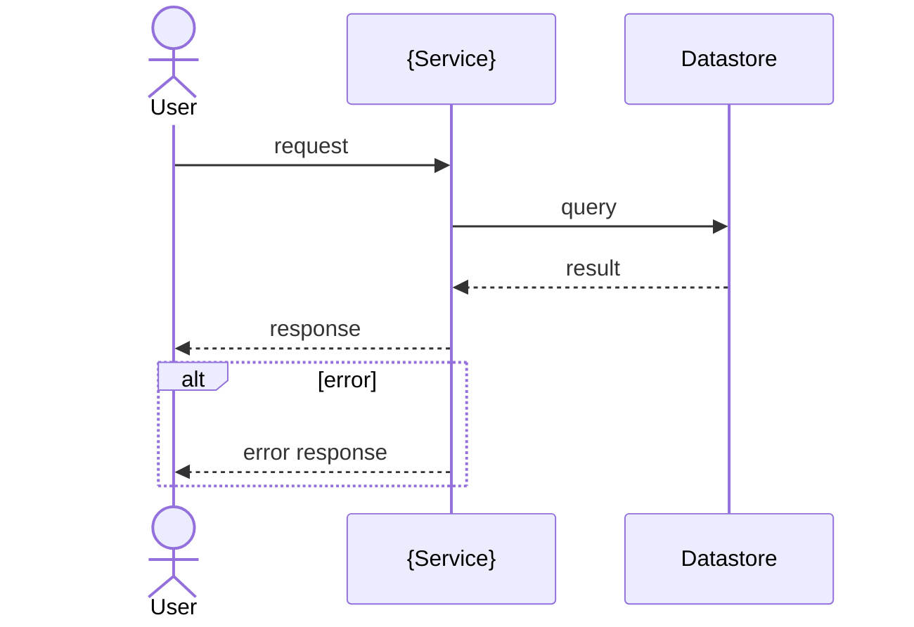

# {Service / Feature} — Redesign Architecture

<!--
Simplified arc42 (to-be design). Rules:
- Fill every {placeholder}. Keep section numbers and heading text EXACTLY as written.
- Mandatory sections (1, 3, 5, 9) are never deleted.
- GATED sections carry an "ask:" question. Ask it; if the answer is no, delete the whole
  section including its heading. Never reorder or renumber what remains.
-->

| Field | Value |
|---|---|
| Service / Component | {name} |
| Owner (team) | {team} |
| Status | Proposed \| Accepted \| Superseded |
| Last updated | {YYYY-MM-DD} |
| Related links | {Jira/RFC} · {repo} · {runbook} |

## 1. Introduction & Goals

{2–4 sentences: what this redesign is and the problem it solves.}

### Quality Goals

| # | Quality attribute | Concrete scenario | Priority |
|---|---|---|---|
| 1 | {e.g. Scalability} | {when X happens, the system does Y} | {High / Med / Low} |

### Stakeholders

| Role | Concern |
|---|---|
| {role} | {what they need from this design} |

<!-- GATED — ask: "Any org / tech / regulatory constraints binding this design?" Delete section 2 if no. -->
## 2. Constraints

- **Technical:** {languages, platforms, mandated libraries…}
- **Organizational:** {team boundaries, process, timelines…}
- **Regulatory:** {GDPR, PCI, data residency…}

## 3. Context & Scope

{System boundary in 1–3 sentences: what is inside this service, what is outside.}

```mermaid
flowchart LR
    user([User]) -->|REST| svc[{Service}]
    svc -->|publishes events| bus[(Event bus)]
    svc -->|reads/writes| db[(Datastore)]
    ext[External system] -->|webhook| svc
```
*Caption: {one line — what this context diagram shows}.*

| External interface | Direction | Protocol | Purpose |
|---|---|---|---|
| {name} | in / out | {REST / Kafka / gRPC…} | {…} |

<!-- GATED — ask: "Top-level strategy worth summarizing (tech stack, decomposition, key patterns)?" Delete section 4 if no. -->
## 4. Solution Strategy

- {Quality goal from §1} → {the approach / technology that achieves it}.
- {Decomposition or pattern choice} → {why}.

## 5. Building Block View

{One line on the decomposition approach.}

```mermaid
flowchart TB
    subgraph svc[{Service}]
        api[API layer] --> core[Domain core]
        core --> repo[Repository]
    end
    repo --> db[(Datastore)]
```
*Caption: {one line — the level-1 building blocks}.*

| Building block | Responsibility |
|---|---|
| {API layer} | {single-sentence responsibility} |
| {Domain core} | {…} |

<!-- GATED — ask: "Does a key scenario need a sequence to be understood?" Delete section 6 if no. -->
## 6. Runtime View

**Scenario: {name}**


*Caption: {one line — what this scenario covers, incl. the error path}.*

<!-- GATED — ask: "Does the redesign change infra / topology / environments?" Delete section 7 if no. -->
## 7. Deployment View

```mermaid
flowchart TB
    subgraph Prod[Production]
        subgraph k8s[Kubernetes]
            pod[{Service} pods]
        end
        db[(Managed DB)]
    end
    pod --> db
```
*Caption: {one line — how building blocks map to infrastructure}.*

<!-- GATED — ask: "Any concern spanning multiple components — auth, logging, error handling, data model, config?" Delete section 8 if no. -->
## 8. Crosscutting Concepts

### {Concept, e.g. Authentication}

{How it works across the system, in a few lines.}

## 9. Architectural Decisions

### ADR 1 — {short title}

- **Status:** Proposed \| Accepted
- **Context:** {what's the issue / what forces are at play}
- **Decision:** {what we're going with, and the core reason}
- **Consequences:** {what becomes easier or harder — only if non-obvious}

<!-- GATED — ask: "Need quality scenarios beyond section 1's goals?" Delete section 10 if no. -->
## 10. Quality Requirements

| Quality | Stimulus | Expected response | Measure |
|---|---|---|---|
| {attribute} | {trigger} | {how the system should behave} | {metric / target} |

<!-- GATED — ask: "Known risks or technical debt the team worries about?" Delete section 11 if no. -->
## 11. Risks & Technical Debt

| Risk / debt | Impact | Mitigation / plan |
|---|---|---|
| {…} | {…} | {…} |
